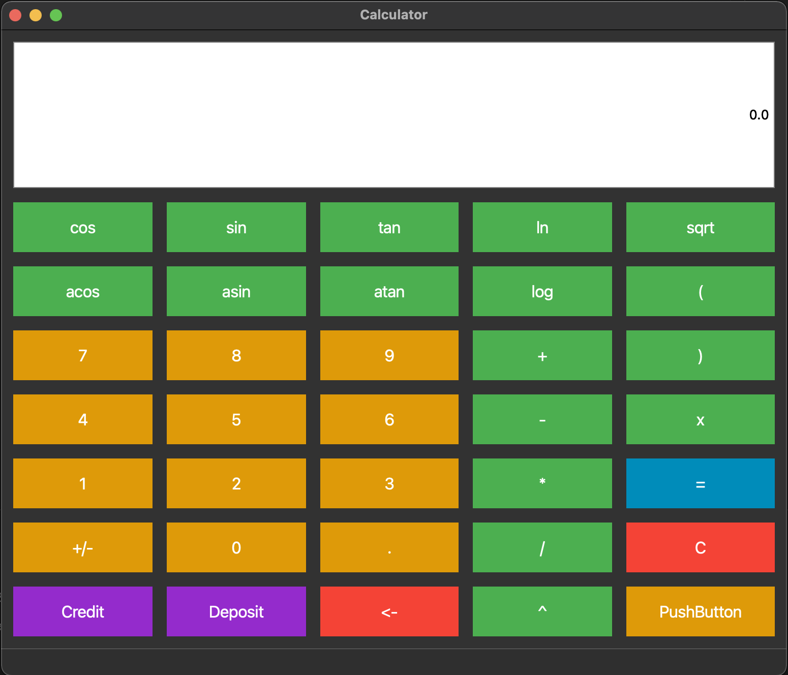
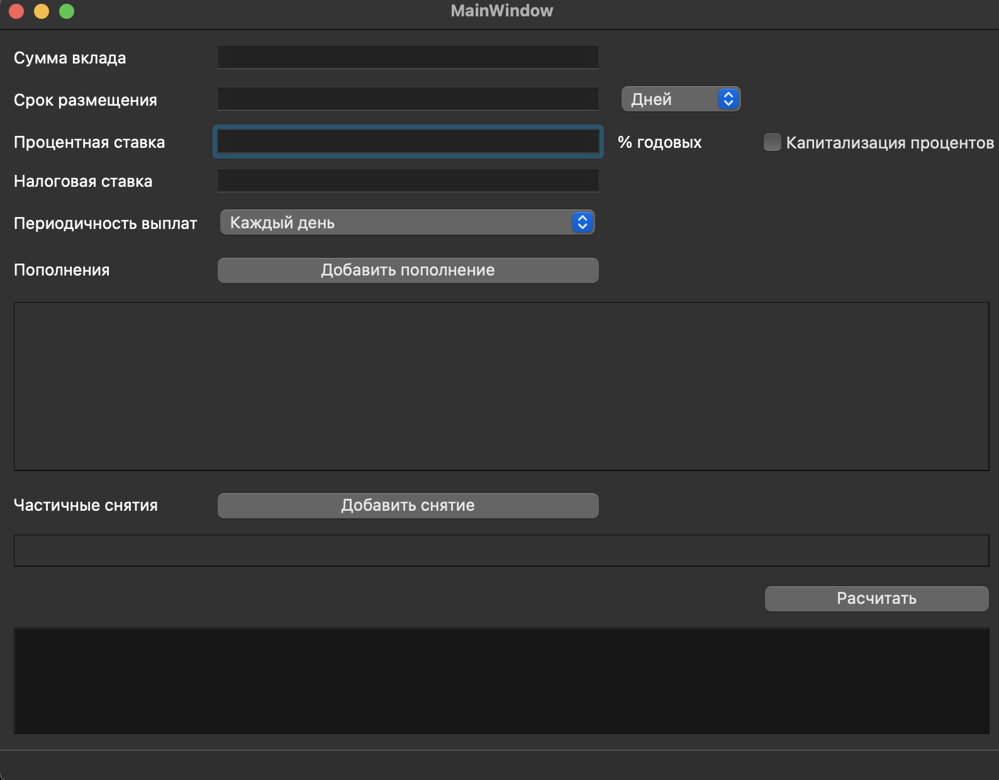
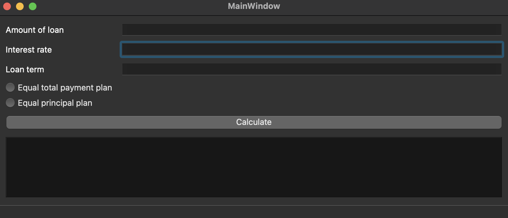
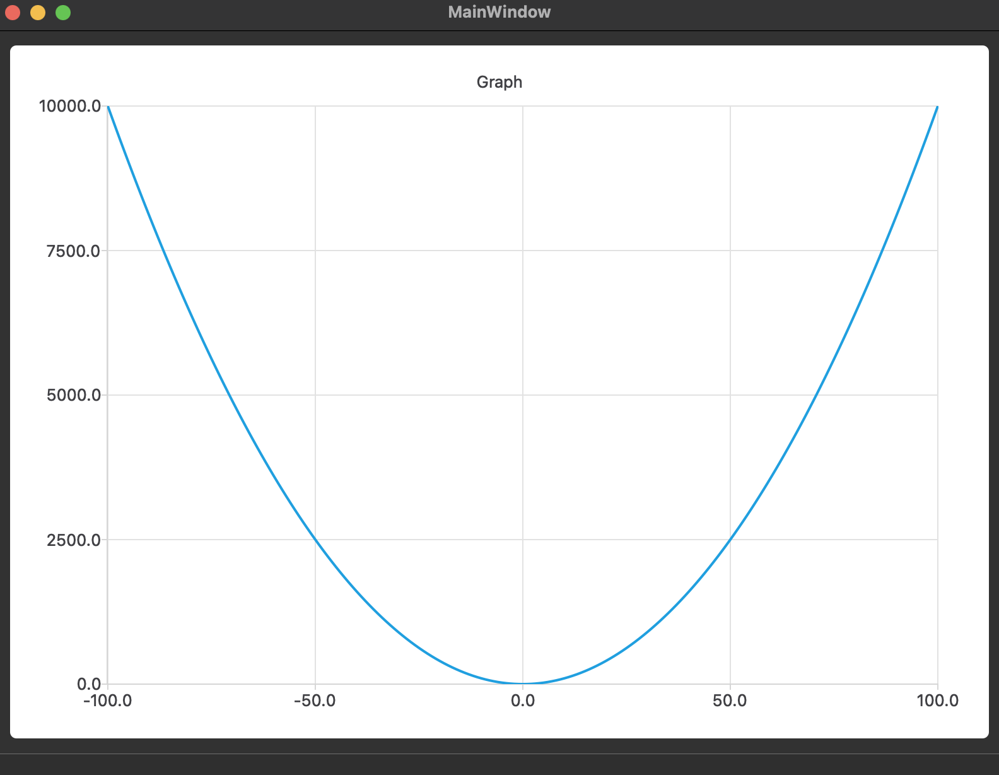

# SmartCalc v1.0

## Contents

0. [Installation](#installation)
1. [Calculator](#calc)
2. [Deposit calculator](#deposit)
3. [Creadit calculator](#credit)
4. [Graph](#graph)

## Installation

Go to source folder from terminal and run command:
> make install

App is in the s21_calc folder and named "Calculator"

## Calculator

## Deposit calculator

## Credit calculator

## Graph

